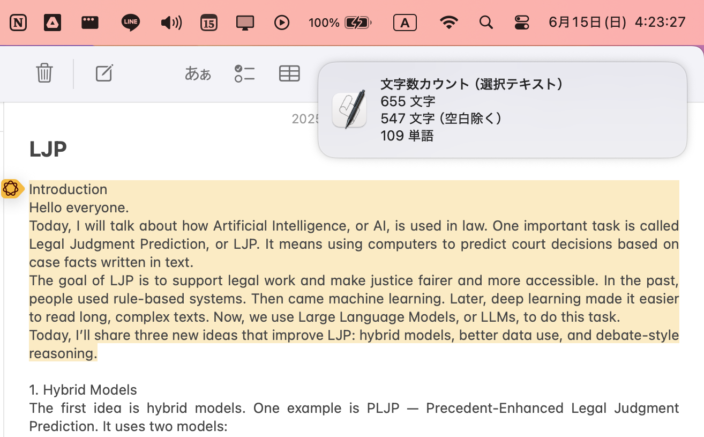

# 文字数カウント for macOS Automator
macOS の Automator クイックアクションで、選択テキストやクリップボードの文字数・単語数をカウントし、通知センターで表示するためのスクリプトです。
キーボードショートカットにより直ちに文字数・単語数を確認することができます。

## 構成
Automator でシェルスクリプトを実行し、シェルスクリプトで Python スクリプトを実行します。
- `word_counter.py`
    - メインの処理ロジック（クリップボードの取得、文字数・単語数のカウント、結果の通知）
- `quick_action.sh`
    - Automator クイックアクションにコピペするスクリプト

## 設定
### クイックアクションを作成
1. Automator.app を起動し、「クイックアクション」を新規作成
2. 「シェルスクリプトを実行」を追加
3. スクリプト欄に quick_action.sh の内容をコピペ（呼び出しても良い）
    1. 通知言語（lang）を設定
        - `lang="jp"`または`lang="en"`
    2. テキスト取得元（source）を設定
        - 選択テキストを取得する場合
            - `source="stdin"` とする
            - 「ワークフローが受け取る項目」は、テキスト
            - 「入力の引き渡し方法」は、stdinへ
        - クリップボードを取得する場合
            - `source="clipboard"` とする
            - 「ワークフローが受け取る項目」は、入力なし
    3. Python ファイルへのパスを設定
        - `word_counter.py` のパスを正しいものに変更する
            - `"$HOME/Projects/word-counter/word_counter.py"`など
4. 保存して命名
    - 補足1：開発者は、「文字数カウント（選択テキスト）」と「文字数カウント（クリップボード）」と命名しました。
    - 補足2：Automator が選択テキストを受け取れないアプリケーションが存在するため、併用を推奨します。（ChatGPTなど）

### キーボードショートカットを設定
1. 設定 > キーボード > キーボードショートカット > サービス で設定
    - 補足：開発者は、「文字数カウント（選択テキスト）」を ^⌘S に、「文字数カウント（クリップボード）を ^⌘C に割り当てました。
        - 頭文字が一致し、また ^⌘C はコピー後すぐに実行できるためです。

### 通知設定
1. 設定 > 通知 > スクリプトエディタ で通知を有効化
    - スクリプトエディタが見つからない場合、以下を参照
        - https://qiita.com/mura_tokagemodoki/items/bbf5b2966905f22783fa
    - 補足：集中モード（おやすみモード）等により、通知が表示されない場合があります。

## 参考
- 本システムは、次の記事のスクリプト部分を変更したものです。
    - https://qiita.com/paupau/items/7140560b30fc4e65253c

## 注意
本スクリプトにおける文字数・単語数の計算は独自の定義に基づいており、他のシステム等による結果と一致することを保証しません。あくまで参考としてご利用ください。